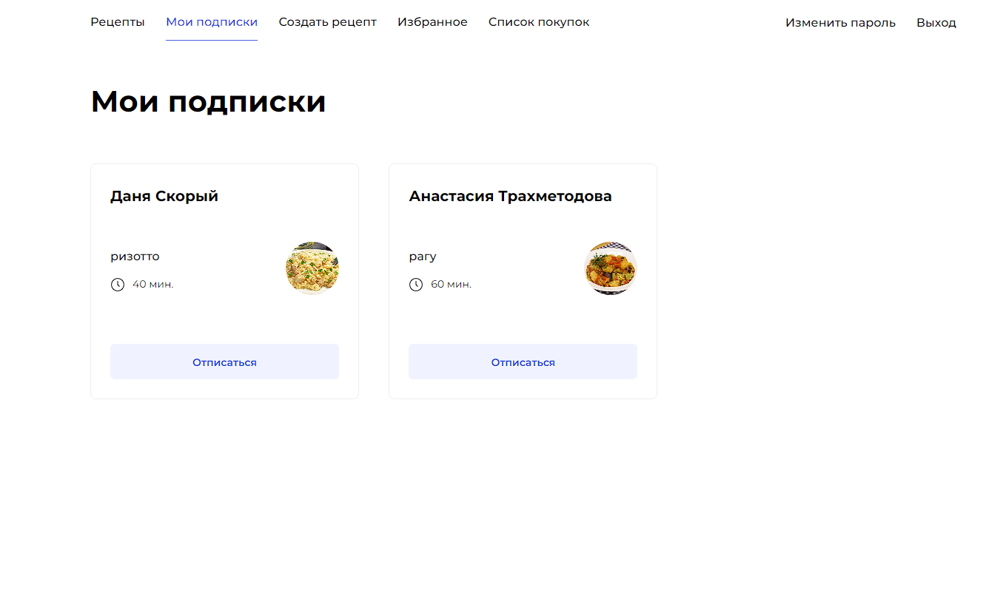

# Ваши рецепты, ваш рацион, ваш Foodgram

## Развертывание проекта

### Развертывание проекта на локальном сервере. Все команды необходимо вводить в консоль находясь в "backend/infra"

1. Сделать клон проекта "git clone https://github.com/AppleIpx/web-site-foodgram.git"
2. Установите docker "https://www.docker.com/products/docker-desktop/"
3. Создайте файл /infra/.env. Шаблон для заполнения файла нахоится в /infra/.env.example
4. Выполните сборку проекта "docker-compose build"
5. Далее необходимо запустить проект "docker-compose up". Миграции и сбор статики происходят автоматически
6. Для заполнения БД необходимо выполнить команду "docker-compose exec backend python manage.py filling_db --no-input"
7. Создайте администратора(супер юзера) "docker-compose exec backend python manage.py createsuperuser"
8. Заходим в браузер и в URL  пишем localhost/ и попадаем на главную страницу
9. Для корректного создания рецепта необходимо через админ панель "localhost/admin/"(указать те данные, которые вы использовали при создании администратра (супер юзера)) и добавить теги,
10. Документация "localhost/api/docs/"

## Техническое задание (ТЗ)

## 1. Введение

### 1.1 Описание проекта

Foodgram - это веб-приложение для планирования блюд и управления списком продуктов. Цель приложения - помочь пользователям удобно планировать приемы пищи и составлять списки покупок.

### 1.2 Контекст проекта

Существует необходимость в создании удобного инструмента для планирования ежедневного питания и автоматической генерации списков покупок на основе выбранных рецептов.

## 2. Требования

### 2.1 Функциональные требования

#### 2.1.1 Основные функции

- Регистрация и аутентификация пользователей.
- Поиск рецептов по категориям и ингредиентам.
- Создание и редактирование персональных списков продуктов.
- Создание, редактирование и удаление рецептов.

## 3. Архитектура

### 3.1 Архитектурные решения

- Backend: Django с использованием Django REST framework.
- База данных: PostgreSQL.

### 3.2 База данных

- База данных будет содержать таблицы для пользователей, рецептов и списков продуктов.

## 4. Разработка

### 4.1 План разработки

- Этап 1: Проектирование базы данных и бэкенда.
- Этап 2: Тестирование и отладка.
- Этап 3: Релиз и развертывание.

### 4.2 Ресурсы и инструменты

- Python, Django, Django REST framework для бэкенда.
- Инструменты для автоматического тестирования.

## 5. Тестирование

### 5.1 План тестирования

- Тестирование функциональности регистрации и аутентификации.
- Тестирование поиска рецептов и создания списков продуктов.

## 6. Документация

- Создание документации по API.

### Результат работы:

## Авторизация и Регистрация:

- Пользователи могут создавать учетные записи и входить в систему.
- Пользователи разделяются на администраторов и обычных пользователей.

## Рецепты:

- Пользователи могут создавать, редактировать и удалять свои рецепты.

- Каждый рецепт включает информацию, такую как название, описание, ингредиенты, время приготовления и теги.

- Рецепты можно отмечать как избранные и добавлять в список покупок.

## Ингредиенты:

- Пользователи могут просматривать список ингредиентов и выбирать их при создании рецептов.

## Избранные Рецепты:

- Пользователи могут добавлять рецепты в избранные и просматривать их.

- Есть возможность удаления рецептов из избранных.

## Список Покупок:

- Пользователи могут добавлять рецепты в свой список покупок и просматривать его.

- Есть возможность удаления рецептов из списка покупок.

## Публичные Рецепты:

- Пользователи могут просматривать рецепты, опубликованные другими пользователями.

- Поиск рецептов по тегам.

## Теги:

- Рецепты могут быть помечены тегами (например, завтрак, обед, ужин).
- Пользователи могут просматривать рецепты по тегам.

## Подписки и Подписчики:

- Пользователи могут подписываться на других пользователей.

- Пользователи могут просматривать ленту рецептов от пользователей, на которых они подписаны.

